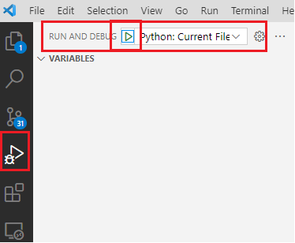
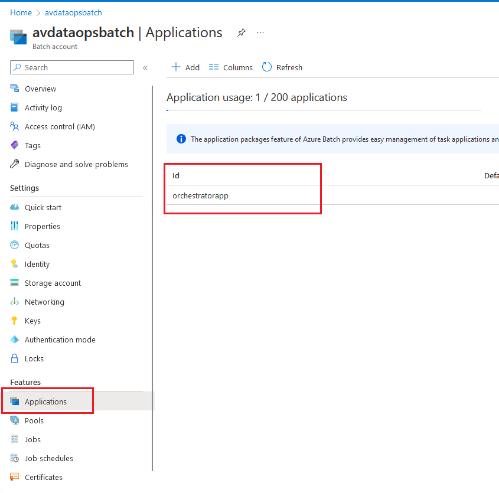
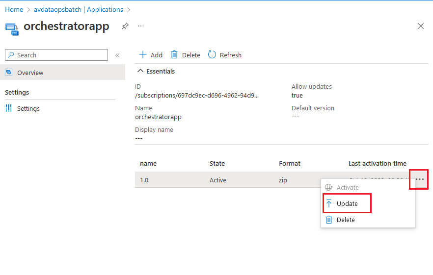

# Batch Orchestrator

This repo has the source code which runs on a bacth node as a command passed from ADF. Code is written based on the architecture described [here]("https://contoso.atlassian.net/wiki/spaces/ADA/pages/2323743037/ADF+pipeline+-+Raw+to+extracted+zone").

## Running the code locally
* After clonning the repo `cd av-batch-orchestrator`
* Update the args in the `.vscode/launch.json` with which you want to test.

Sample Args
```
["--measurementId=7e5dd17c-d299-41b9-8bb0-cac28b4c2b72", "--rawDataStreamPath=raw/2022/10/10/KA01LB1234/7e5dd17c-d299-41b9-8bb0-cac28b4c2b72/fe7ebfc7-7f94-4c0f-81f2-0919c69411e4", "--files=Duster__2022-09-30-12-50-38_77.bag", "--extractedDataStreamPath=extracted/2022/10/10/KA01LB1234/7e5dd17c-d299-41b9-8bb0-cac28b4c2b72/1a464c73-80b4-4791-9922-fd42dde278fb", "--extractedDataStreamId=1a464c73-80b4-4791-9922-fd42dde278fb"]
```
* For local run configurations are picked from the `av-batch-orchestrator/.env` file. So create .env file by renaming .env.template and update the values for the following variables:

```
RUN_ENVIRONMENT="local" // This can local for loacl and cloud when run from the batch.
AZ_KEYVAULT_NAME=""  // NOT required for the local env
AZ_BATCH_ACCOUNT_URL="" // Batch account url
AZ_BATCH_ACCOUNT_NAME="" // Name of the batch account
AZ_BATCH_KEY=""          // Batch key
AZ_BATCH_EXECUTION_POOL_ID=""  //Execution pool id
API_BASE_URL=""               // meta data api base url without the ending slash, e.g `https://av-metadata-apis.azurewebsites.net/v0.0.2`
RAW_ZONE_CONTAINER=""   // Name of the raw zone container e.g raw
EXTRACTED_ZONE_CONTAINER=""  // Name of the extracted zone container e.g extracted
TASK_RETRY_COUNT=""  Task retry count, number of time a task can be retried. e.g 2
```
* Keep the app/app.py as the current file and run the debug task `Python: CurrenFile` from the debug window.




## Running code from the Batch
* Update values for `app/.env` file (rename env.template to .env), this file doesn't to be provided with any secrets as all the secrets will be refered from KeyVault.
* Create a zip of app folder.
* Upload the zip folder to azure batch service applications.
* For detailed instructions read [this documentation](https://learn.microsoft.com/en-us/azure/batch/batch-application-packages)

Step 1.


Step 2.


* Use ADF `Custom Activity` with a command line as follows:
```
/bin/bash -c "cd $AZ_BATCH_APP_PACKAGE_orchestratorapp_1_0/app && python3 app.py '{\\\"measurementId\\\":\\\"eb9150eb-df4b-4a53-a49b-42573875e004\\\",\\\"rawDataStreamPath\\\":\\\"raw/2022/10/10/KA01LB1234/eb9150eb-df4b-4a53-a49b-42573875e004/ecb54806-379e-4cbb-9890-ce63defb3837\\\",\\\"files\\\":[\\\"file1\\\",\\\"file2\\\",\\\"file3\\\"],\\\"extractedDataStreamPath\\\":\\\"extracted/2022/10/10/KA01LB1234/eb9150eb-df4b-4a53-a49b-42573875e004/e4db23d1-6f77-4b3a-8a96-d3df4fb11f68\\\",\\\"extractedDataStreamId\\\":\\\"e4db23d1-6f77-4b3a-8a96-d3df4fb11f68\\\"}'"
```

